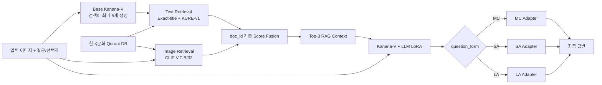

# AIVQA: 외국인을 위한 한국문화 Multimodal RAG VQA

이미지와 한국어 질문을 함께 이해하고, 외부 한국문화 지식을 검색해 문항 유형에 맞는 답을 생성하는 멀티모달 질의응답 시스템입니다. `kakaocorp/kanana-1.5-v-3b-instruct`에 Text·Image RAG와 LLM-only LoRA를 결합하고, MC·SA·LA 유형별 Adapter로 답변 생성을 특화했습니다.

> **Final Average 47.40** — 3B Kanana-V 기반 시스템으로 EXAONE-4.5-33B-VL LoRA baseline(46.99)을 상회했습니다.

[💻 전체 구현 코드](https://github.com/kjh0902/AIVQA) · [▶ Live Demo](https://youtube.com/shorts/V9Fk6n_ODyo?feature=share) · [🤗 Base Model](https://huggingface.co/kakaocorp/kanana-1.5-v-3b-instruct)

## Team

비타민 17기 CV조

- 곽혜진
- 김준형
- 이신영
- 이정빈

## 프로젝트 개요

일반적인 VQA와 달리 한국문화 질의응답은 이미지 인식만으로 풀기 어렵습니다. 문화재·의복·생활 도구의 **고유명사와 배경지식**, 이미지 속 작은 글씨, 그리고 음절·어절 수와 같은 **출력 형식 제약**을 함께 처리해야 합니다.

이 프로젝트는 다음 세 단계를 하나의 파이프라인으로 연결합니다.

1. **Multimodal Retrieval**: 질문의 textual clue와 이미지의 visual clue로 한국문화 지식 DB를 검색합니다.
2. **RAG-aware Training**: 추론과 동일한 RAG context를 학습에도 제공해 외부 지식 활용법을 LoRA에 학습시킵니다.
3. **Shared-to-Specialized**: 공통 표현을 학습한 Shared Adapter에서 출발해 MC·SA·LA Adapter를 독립적으로 분기합니다.

### 문항 유형과 평가 지표

| 유형 | 출력 형식 | 평가 지표 | 데이터 비중 |
| --- | --- | --- | ---: |
| MC | 5지선다 정답 번호, 복수 정답은 `1/3` 형식 | Accuracy | 약 52% |
| SA | 단어·구 수준의 단답, 음절·어절 수 제약 포함 | Exact Match | 약 26% |
| LA | 250자 이하의 한 문단 서술 | `(ROUGE-1 F1 + BLEU-1) / 2` | 약 22% |

최종 점수 `final_score`는 세 유형 지표를 동일 가중 평균합니다.

### 데이터 구성

| Split | 전체 | MC | SA | LA |
| --- | ---: | ---: | ---: | ---: |
| Train | 1,000 | 518 | 254 | 228 |
| Validation | 200 | 103 | 52 | 45 |
| Test | 800 | 415 | 206 | 179 |

## 전체 아키텍처



추론 시 Base Kanana-V가 먼저 검색어를 만들고, Text·Image 검색 결과를 합친 뒤 질문 유형에 맞는 best Adapter로 전환해 답을 생성합니다. 검색 단계에는 답변 Adapter를 붙이지 않아 Adapter 변화에 따른 retrieval drift를 방지합니다.

## 핵심 방법론

### 1. 한국문화 Multimodal RAG

RAG DB는 기존 학습 데이터가 아닌 다음 네 곳의 공개 한국문화 지식원을 공통 schema로 통합해 구축했습니다.

- 한국민족문화대백과사전(EncyKorea)
- 한국민속대백과사전(FOLKENCY)
- 국립중앙박물관 e뮤지엄
- 국가유산포털(국가유산청)

각 JSONL row는 하나의 한국문화 entity이며 다음 6개 필드를 가집니다.

```json
{
  "doc_id": "khs_1110000100000",
  "source": "국가유산청",
  "title": "숭례문",
  "search_terms": ["숭례문", "남대문", "국보", "서울특별시"],
  "description": "문화유산 상세 설명 ...",
  "image_path": ["rag_db/images/khs/...0.jpg"]
}
```

Qdrant에는 entity 하나를 point 하나로 저장합니다.

- **Text vector**: `search_terms`를 KURE-v1으로 임베딩하고 cosine similarity로 검색합니다. 생성 검색어와 `title`이 정확히 일치하면 semantic search보다 우선해 `text_score=2.0`을 부여합니다.
- **Image multivector**: entity의 여러 reference image를 CLIP ViT-B/32로 각각 임베딩하고 `MAX_SIM`으로 비교합니다. 평균 vector 대신 가장 닮은 한 장을 남겨 촬영 각도·배경 변화에 대응합니다.
- **Score fusion**: 같은 `doc_id`의 결과를 병합하고 `s_final = s_text + s_image`로 정렬해 상위 3개 문서를 사용합니다.
- **Deterministic ID**: `doc_id`에서 UUID v5를 생성하므로 중단 후 재실행해도 중복 없이 upsert할 수 있습니다.

검색 결과는 정답이 아닌 **soft reference**로 prompt에 전달합니다. 모델에는 사진·질문과 맞지 않는 검색 결과를 무시하도록 명시해 retrieval error의 영향을 줄입니다. Train·validation·test 검색 결과는 `rag_cache/`에 한 번 저장하고 학습과 추론에서 동일하게 재사용합니다.

구현 상세는 [RAG DB 문서](https://github.com/kjh0902/AIVQA/blob/main/rag_db/README.md)를 참고하세요.

### 2. LLM-only LoRA

```text
Image
  ↓
Kanana Vision Encoder       [Frozen]
  ↓
Kanana C-Abstractor         [Frozen]
  ↓
Kanana Language Model       [Frozen base + LoRA]
  ↓
Answer
```

Vision Encoder와 C-Abstractor는 고정하고, 32개 LLM decoder layer의 self-attention projection인 `q_proj`, `k_proj`, `v_proj`, `o_proj` 총 128개 module에만 LoRA를 적용합니다.

| 설정 | 값 |
| --- | ---: |
| Rank `r` | 16 |
| Alpha | 32 |
| Dropout | 0.05 |
| Trainable scope | LLM LoRA only |

학습 loss는 assistant answer token에만 적용합니다. System prompt, 질문, 선택지, RAG context, image placeholder와 padding token은 모두 `-100`으로 masking합니다.

### 3. Shared Adapter → 유형별 Adapter

Train 전체로 Shared Adapter를 먼저 학습하고 validation `final_score`가 가장 높은 checkpoint를 선택합니다. 이어서 동일한 Shared checkpoint에서 MC·SA·LA를 각각 독립적으로 학습합니다.

| 단계 | 최대 Epoch | Best checkpoint 기준 | Early stopping |
| --- | ---: | --- | ---: |
| Shared | 5 | `final_score` | 2 epochs |
| MC | 10 | `mc_accuracy` | 2 epochs |
| SA | 10 | `sa_exact_match` | 2 epochs |
| LA | 10 | `descriptive_avg` | 2 epochs |

SA는 질문에서 음절·어절 수와 복수 답변 조건을 파싱합니다. 첫 생성이 형식 검사를 통과하지 못하면 실패 이유와 원문 질문을 함께 제공해 최대 3회 다시 풉니다. 답을 기계적으로 자르는 대신 의미와 형식을 모두 만족하는 답을 재생성합니다.

구현 상세는 [유형별 Adapter 문서](https://github.com/kjh0902/AIVQA/blob/main/type_adapters/README.md)를 참고하세요.

## 실험 결과

동일한 단순 LoRA 비교에서 Kanana-V 3B는 여러 8B~12B VLM보다 높은 평균 점수를 기록해 최종 base model로 선정됐습니다. 여기에 Multimodal RAG와 유형별 Adapter를 결합한 최종 시스템의 Average는 **47.40**입니다.

| 시스템 | Parameters | Average |
| --- | ---: | ---: |
| **AIVQA: Kanana-V + Multimodal RAG + Type Adapters** | **3B** | **47.40** |
| EXAONE-4.5-33B-VL + LoRA | 33B | 46.99 |
| Kanana-1.5-V-3B + LoRA baseline | 3B | 44.63 |
| Qwen3-VL-8B + LoRA | 8B | 40.19 |
| InternVL3.5-8B + LoRA | 8B | 33.80 |

최종 시스템은 동일한 3B baseline보다 **+2.77p**, 33B EXAONE baseline보다 **+0.41p** 높은 Average를 기록했습니다.

## 시작하기

### 1. 환경 준비

Python 3.11과 CUDA GPU 환경을 권장합니다. 아래 예시는 CUDA 12.8을 사용하는 RTX 50 시리즈 기준입니다.

```bash
git clone https://github.com/kjh0902/AIVQA.git
cd AIVQA

conda create -n aivqa python=3.11 -y
conda activate aivqa
python -m pip install --upgrade pip
python -m pip install torch torchvision --index-url https://download.pytorch.org/whl/cu128
python -m pip install -r requirements.txt
```

Kanana-V는 Hugging Face custom code를 사용하므로 모델 로딩에 `trust_remote_code=True`가 필요합니다. 해당 설정은 저장소 코드에 반영돼 있습니다.

### 2. 데이터 배치

원본 데이터와 대용량 RAG asset은 Git에 포함하지 않습니다. 아래 기본 경로에 별도로 배치하세요.

```text
datasets/한국문화 멀티모달 질의응답/
├── 한국문화 멀티모달 질의응답_train.json
├── 한국문화 멀티모달 질의응답_validation.json
└── 한국문화 멀티모달 질의응답_test.json

rag_db/
├── unified_rag.jsonl
└── images/
```

각 VQA record에서 사용하는 필드는 다음과 같습니다.

- `metadata.question_id`, `metadata.split`, `metadata.question_form`
- `model_input.image_name` 또는 `image_path` 또는 `image`
- `model_input.question`, `model_input.options`
- Train·validation의 `model_output.answer`

### 3. Qdrant Multimodal DB 구축

```bash
python rag_db/build_qdrant.py --recreate
```

기본 embedded storage는 `rag_db/qdrant_storage/`, collection 이름은 `aivqa_unified_rag`입니다. 중단 후 이어서 구축할 때는 기존 collection을 지우지 않도록 `--recreate`를 제외하세요.

외부 Qdrant server를 사용할 수도 있습니다.

```bash
python rag_db/build_qdrant.py \
  --qdrant-url http://localhost:6333 \
  --recreate
```

### 4. 고정 RAG cache 생성

```bash
python build_rag_cache.py
```

Base Kanana-V가 각 split의 검색어를 생성하고 Text·Image retrieval을 수행합니다. 결과는 다음 경로에 저장됩니다.

```text
rag_cache/
├── train.json
├── validation.json
└── test.json
```

RAG encoder는 학습 VRAM을 확보하기 위해 기본적으로 CPU에서 실행합니다. 별도 Qdrant server와 GPU를 사용하려면 다음처럼 지정합니다.

```bash
python build_rag_cache.py \
  --qdrant-url http://localhost:6333 \
  --rag-device cuda
```

### 5. 전체 학습·추론 파이프라인 실행

```bash
python run_rag_pipeline.py
```

이 명령은 고정 cache를 검증한 뒤 Shared → MC → SA → LA 순으로 Adapter를 학습하고, 문항 유형별 best Adapter로 test 답변을 생성합니다. 현재 통합 파이프라인 기본값은 다음과 같습니다.

- BF16, batch size 1, gradient accumulation 8
- `max_length=4096`, 약 200~400 visual token
- Shared learning rate `3e-5`, type learning rate `2e-5`
- Shared/type weight decay `0.03`, warmup ratio `0.10`
- RAG Top-3, 각 문서 description 최대 1,500자

4-bit frozen base weight가 필요하면 `--load-in-4bit`를 추가하세요.

```bash
python run_rag_pipeline.py --load-in-4bit
```

### 6. 결과 확인

```text
outputs/kanana_1_5_v_3b_rag_pipeline/run_YYYYMMDD_HHMMSS/
├── shared_adapter/
├── mc_adapter/
├── sa_adapter/
├── la_adapter/
├── type_training_summary.json
├── pipeline_summary.json
└── answer.json
```

`answer.json`은 원본 test record 순서를 보존하며 `model_output.answer`에 최종 예측을 기록합니다. 원본 데이터 파일은 수정하지 않습니다.

## 개별 실행

RAG 없이 기본 LoRA만 학습하거나 zero-shot·단일 이미지 추론을 별도로 실행할 수 있습니다.

```bash
# LLM-only LoRA baseline
python train_lora.py

# 학습 전 zero-shot 예측
python generate_zero_shot.py

# 단일 이미지 질의응답
python infer_single_image.py \
  --image datasets/test/0001.jpg \
  --question "이 이미지에 무엇이 보이나요?"
```

전체 옵션은 각 명령의 `--help`에서 확인할 수 있습니다.

## 저장소 구조

```text
AIVQA/
├── aivqa/                    # 데이터셋, collator, 평가 지표, SA 형식 검증
├── rag_db/                   # Qdrant 구축, Text·Image retrieval, RAG prompt
├── type_adapters/            # MC·SA·LA Adapter 학습 및 routing 추론
├── tests/                    # 모델 weight 없이 실행 가능한 단위 테스트
├── build_rag_cache.py        # Split별 retrieval cache 생성
├── run_rag_pipeline.py       # 전체 RAG 학습·추론 orchestration
├── train_lora.py             # Shared/baseline LLM-only LoRA 학습
├── generate_zero_shot.py     # Zero-shot test 예측
├── infer_single_image.py     # 단일 이미지 추론
└── requirements.txt
```

## 테스트

단위 테스트는 모델 weight를 다운로드하지 않고 실행됩니다.

```bash
python -m unittest discover -s tests -v
```

## 한계와 향후 과제

- SA의 음절·어절 수 제약은 재시도로 완화하지만 완전한 보장은 어렵습니다. 생성 과정 자체를 통제하는 constrained decoding이 필요합니다.
- 작은 글씨가 핵심인 문항은 이미지 해상도와 visual token·VRAM 사이의 trade-off가 큽니다. OCR 필요도를 판단해 선택적으로 고해상도 입력을 사용하는 전략을 확장할 수 있습니다.
- Retrieval 품질은 외부 지식 DB의 범위와 entity-image mapping 정확도에 영향을 받습니다.
